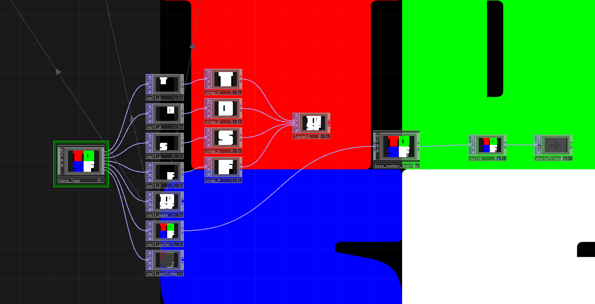
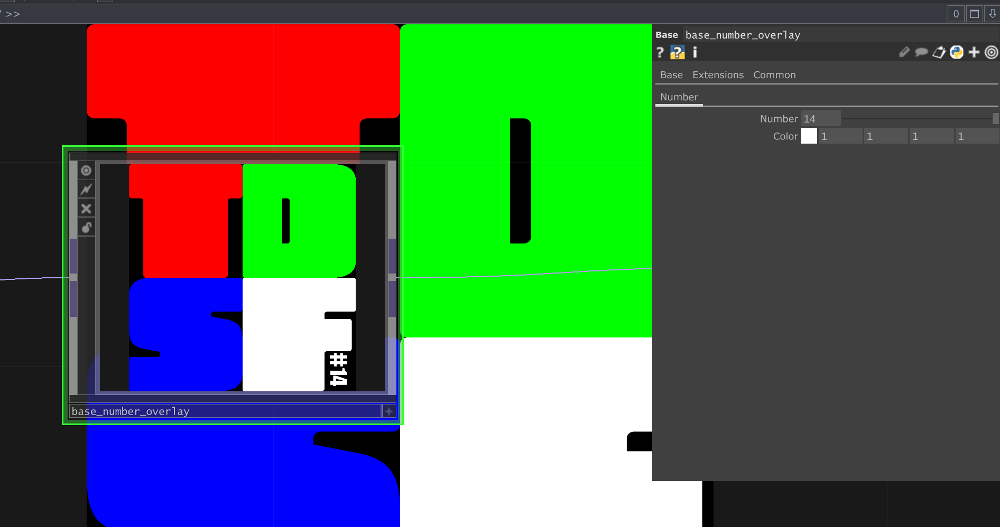

# Logo

assets for logo and reels!

This repo is for 

1) storing/sharing the logo assets,
2) a TouchDesigner project for adding animations to the different layers.

## Logo Origins

Logo v3 what designed by @igierard using Adobe Illustrator as is available under `v3/assets/BigBlock.ai`. A svg version is also available  `v3/assets/BigBlock.svg` The logo uses a modified version of the font Pitch Black. 

Original logo was designed by @TylerMclaughlin using Keynote, the default MacOS PowerPoint alternative.
The file extension for Keynote projects is `.key`, and you can find these files in the `v1/assets/` directory.

If you don't have Keynote,
fortunately you can work with the `.png` files.

Please do not use v1 or v2 of the logo as derivative has deemed it too similar to their trademarked branding.

## Base Project File

We have provided a base version of the TDSF logo loop for to start new projects with.

The project provides a base for building new video loops by providing masks and cut outs that you can use to make your creations.

The various masks you may want have been broken out from the base logo in the _base_logo_ COMP

The expected output is 2048x2048.

We have included a COMP to easily overlay the #number in the corner as well under the _base_number_overlay_ COMP There are custom parameters for the event number and color.

Please name your creations `tdsf{EVENT_NUMBER}.toe`

Keep assets for your project under `v3/assets/tdsf{EVENT_NUMBER}/`