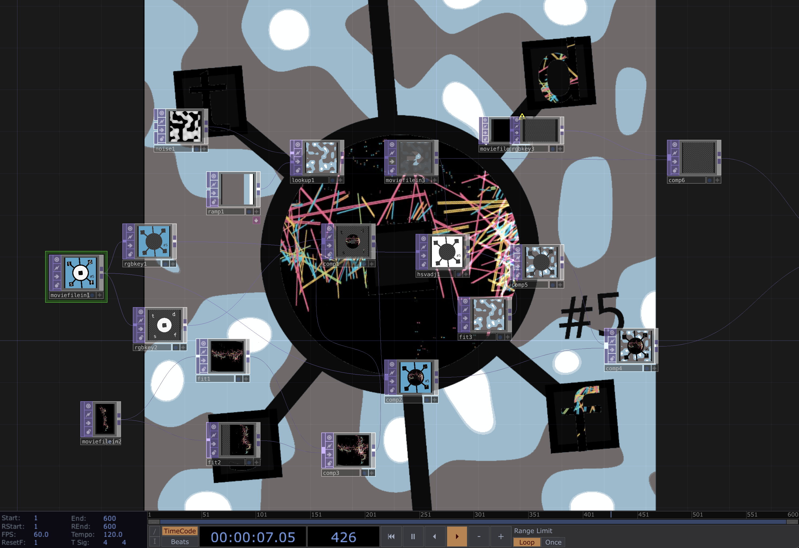

# logo

assets for logo and reels!

This repo is for 

1) storing/sharing the logo assets,
2) a TouchDesigner project for adding animations to the different layers.

## Logo Origins

I built the initial logo graphic using Keynote, the default MacOS PowerPoint alternative.
The file extension for Keynote projects is `.key`, and you can find these files in the `assets/` directory.

If you don't have Keynote,
fortunately you can work with the `.png` files.

## TouchDesigner Project 

The way the TD project works is:

I load a logo `.png` (included in `assets/`).
Then I separate the layers using `RGB Key` TOPs, 'replace' them with independent video sources,
and combine them with `Composite` TOPs.

## RGB keying guide

### White

To isolate the *white elements* of the image, use an `RGB Key`, 
and increase `Red Min` or `Blue Min` slightly, until the white is the only non-transparent layer. 

You can then use a `Composite` TOP set to `Multiply` to replace the white elements with any video.

### Green 

To *isolate the green background* with an `RGB Key` TOP,
increase `Green Min` and decrease `Red Max` slightly,
until now the green background is the only thing that's non-transparent.

Make it white with an `HSV Adjust` TOP by setting `Saturation Multiplier` to 0.
Then you can replace this layer with any video using a `Composite` TOP with operation set to `Multiply`

### Black

And to *isolate the black graphic elements*, decrease the `RGB Key`'s `Green Max` parameter.  

### Combining

After separating the three elements and using them as masks with your videos,
you'll want to combine the three separate layers.

To combine the layers, you can just use `Composite` TOPs with 
the compositing operation set to `Atop`
